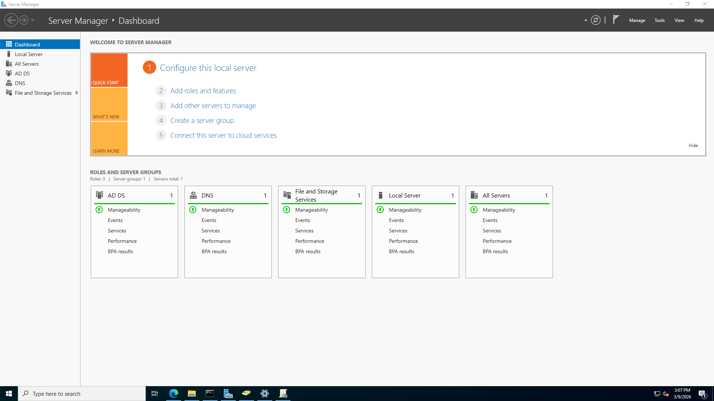
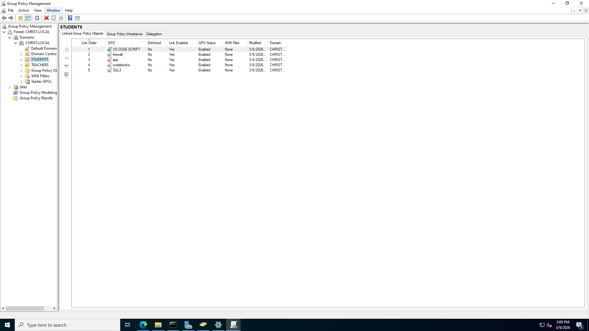
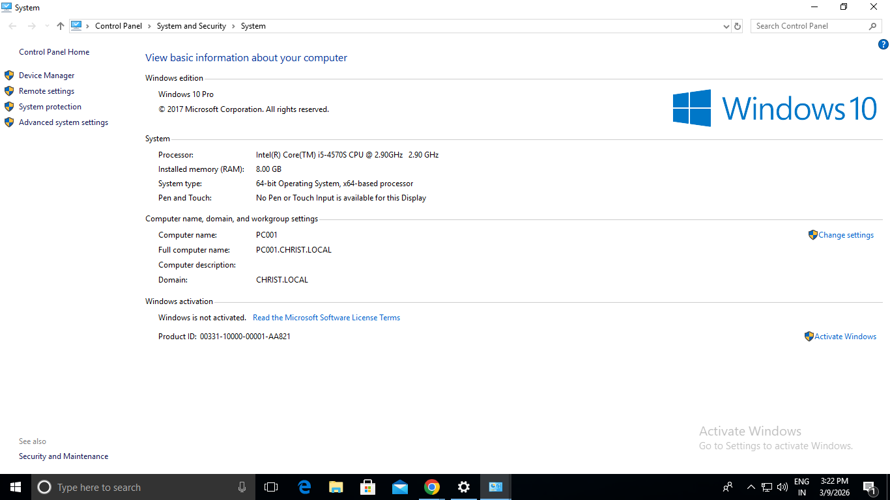
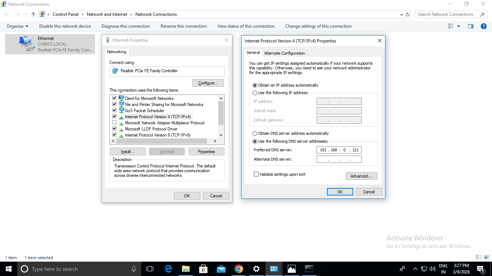

# Windows Server 2022 Active Directory Lab

## Overview

This project demonstrates the deployment and configuration of a Windows Server 2022 Domain Controller used to manage multiple client computers in a college laboratory environment.

The lab implements centralized authentication, automated configuration of client machines, and stable network management using Active Directory, DNS, Group Policy, and DHCP reservation.

---

## Lab Environment

### Server

Operating System: Windows Server 2022 Standard
Role: Domain Controller

Domain Name: CHRIST.LOCAL
Server IP Address: 192.168.0.121

Hardware:

* Intel i5 Processor
* 8 GB RAM

DNS services are hosted on the domain controller.

---

### Client Computers

Client machines are connected to the domain and managed through Active Directory.

Client PCs:

PC001
PC002
PC003
PC004
PC005

Operating System:
Windows 10 Pro

Each client authenticates users using the Active Directory domain controller.

---

## Server Roles Installed

The following roles were installed on Windows Server:

* Active Directory Domain Services (AD DS)
* DNS Server
* File and Storage Services

Active Directory allows centralized management of users, computers, and policies across the domain.

---

## Active Directory Structure

Domain Name:
CHRIST.LOCAL

Organizational Units created:

STUDENTS
TEACHERS

Client computers are placed inside appropriate organizational units for easier management and policy control.

---

## Group Policy Configuration

Group Policy Objects (GPOs) were created and linked to the **STUDENTS Organizational Unit**.

These policies automate system configuration and software installation on student computers.

Configured policies include:

* VS Code installation script
* Firewall configuration
* Application setup scripts
* CodeBlocks installation
* SQL software installation

## Script Files

install-vscode.bat  
scripts/install-vscode.bat

install_codeblocks.bat  
scripts/install_codeblocks.bat

install_sqlite3.bat  
scripts/install_sqlite3.bat

firewall-config.bat  
scripts/firewall-config.bat

These policies automatically apply when users log in or when computers join the domain.

---

## Network Configuration

Network infrastructure uses a D-Link router.

Router Gateway:
192.168.0.1

To maintain consistent IP addressing, **DHCP reservation** was configured using MAC addresses.

This ensures each client computer always receives the same IP address.

Example configuration:

PC001 → 192.168.0.101
PC002 → 192.168.0.102
PC003 → 192.168.0.103
PC004 → 192.168.0.104
PC005 → 192.168.0.105

Clients use the domain controller as their DNS server.

DNS Server:
192.168.0.121

This configuration ensures proper domain authentication and communication with Active Directory services.

---

## Automation Scripts

Software installation and configuration were automated using scripts deployed through Group Policy.

Example scripts included in this project:

* install-vscode.bat
* install-codeblocks.bat
* firewall-config.ps1
* sql-install.bat

These scripts allow automatic installation of required tools on student computers without manual setup.

---

## Lab Architecture

```
                Router
            192.168.0.1
                  │
                  │
        Windows Server 2022
        Domain Controller
        IP: 192.168.0.121
        Domain: CHRIST.LOCAL
                  │
     ┌────────────┼────────────┐
     │            │            │
   PC001        PC002        PC003
 Windows 10    Windows 10    Windows 10

     │
 Group Policy
     │
 Automatic Software Deployment
```

---

## Screenshots

### Server Manager Dashboard



### Active Directory Users and Computers


### Group Policy Configuration



### Client Domain Join



### Client DNS Configuration



## Problems Faced During Setup

Problem 1: Client computers receiving random IP addresses
Solution: Configured DHCP reservation on the router based on MAC addresses.

Problem 2: Domain join failed due to incorrect DNS configuration
Solution: Set the client DNS server to the domain controller IP address.

Problem 3: Manual software installation on multiple machines was time consuming
Solution: Implemented Group Policy scripts for automatic software deployment.

Problem 4: Some client machines were not appearing in Active Directory
Solution: Rejoined the machines to the domain and verified network connectivity.

---

## Skills Demonstrated

This project demonstrates practical skills in:

* Windows Server Administration
* Active Directory Domain Services
* DNS Server Configuration
* Domain Controller Deployment
* Client Domain Integration
* Group Policy Management
* Network Infrastructure Configuration
* DHCP Reservation Configuration
* Script-based Automation

---

## What I Learned

Through this lab I gained hands-on experience in deploying and managing a Windows Server domain environment.

I learned how to configure Active Directory, manage client computers using centralized authentication, automate software installation with Group Policy, and maintain stable networking using DNS and DHCP configuration.

---

## Future Improvements

Possible improvements for this lab environment include:

* Implement stronger security policies using Group Policy
* Configure file sharing server for students
* Deploy centralized log monitoring
* Integrate the lab with SIEM tools such as Wazuh
* Implement Active Directory security auditing

---
